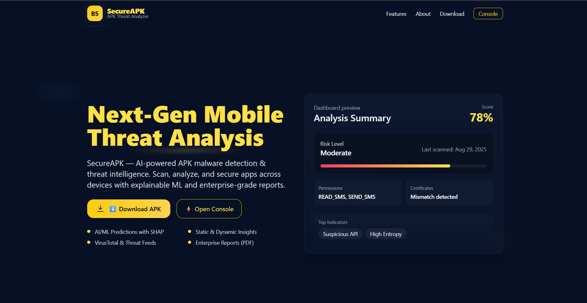
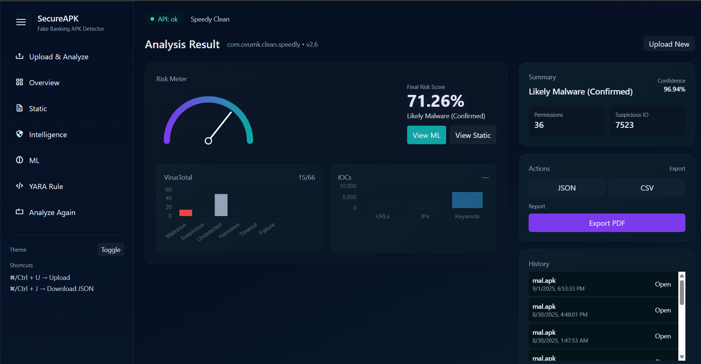
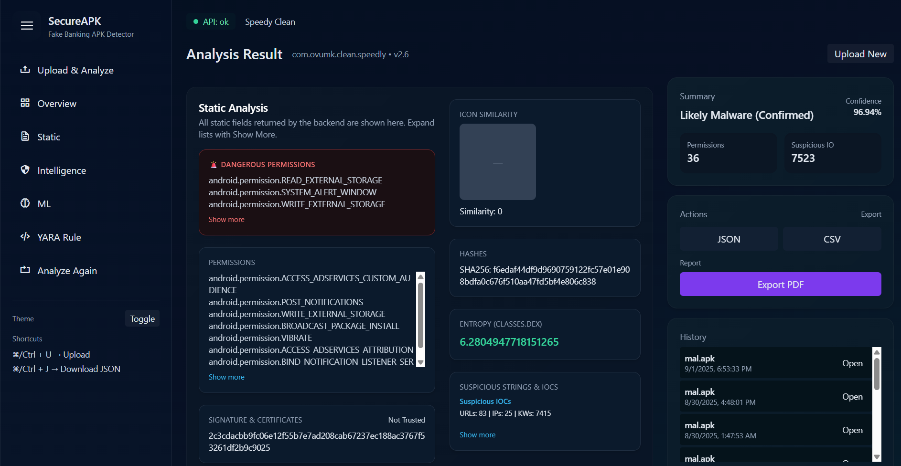
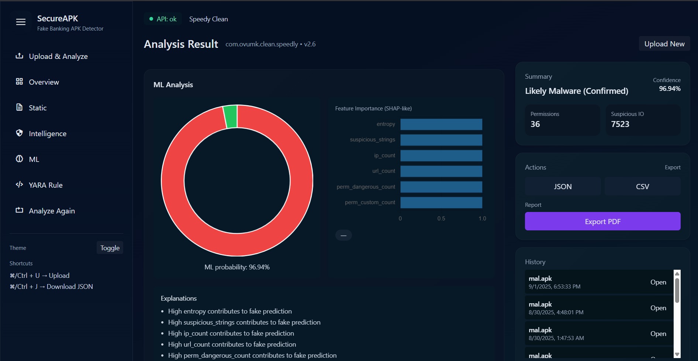
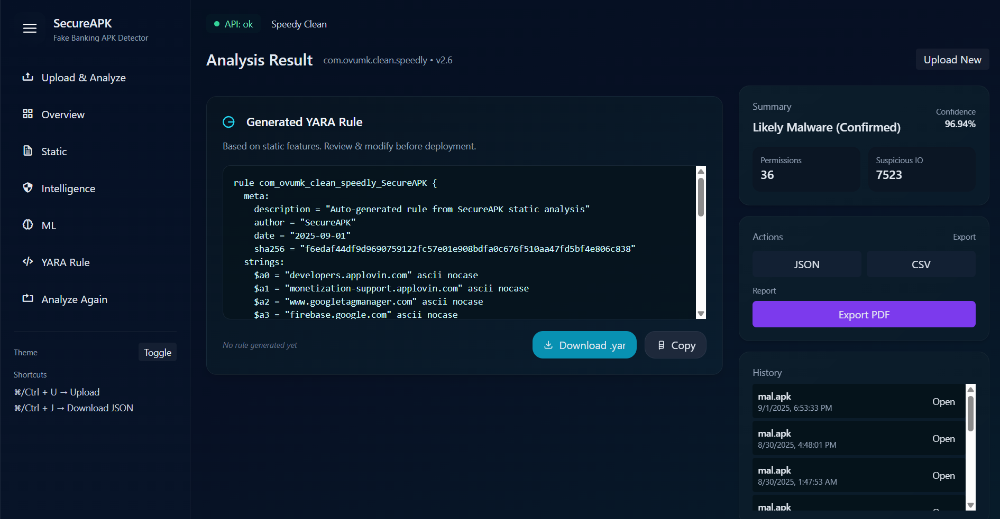
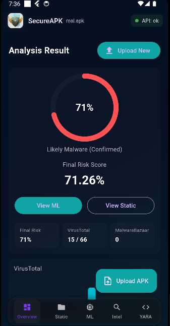
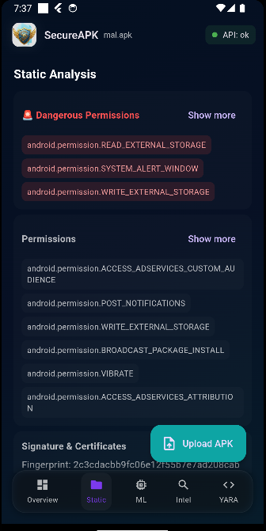

# 🛡️ BankShield – APK Malware Analysis Platform

BankShield is a **multi-platform malware analysis tool** that performs **static APK analysis, ML-based detection, and threat intelligence integration (VirusTotal + MalwareBazaar)**.  
It comes with a **Flask REST API**, a **Web Dashboard**, and an **Android (Flutter) client** with the same analysis capabilities and UI.

---

## 🚀 Features

- 📂 **APK Upload & Analysis**
- 🔍 **Static Analysis** (permissions, certificates, entropy, suspicious strings, IPs/URLs)
- 🤖 **Machine Learning Model** (APK classification + SHAP explainability)
- 🌐 **Threat Intelligence Integration**
  - VirusTotal API
  - MalwareBazaar API
- 📊 **Interactive Web Dashboard**
  - Gauge meter, charts, feature importances
  - YARA rule generator
  - Dark/Light mode
- 📱 **Flutter Android App**
  - Same dashboard as web, native mobile UI
  - Upload APK & view results
- 📑 **Export Results**
  - JSON / CSV / PDF
- 🗂️ **Session History**
  - View past analyses

---

## 🖥️ Project Components

1. **Flask REST API**
   - Provides `/analyze` endpoint for APK submission
   - Handles static analysis, ML model, threat intel
   - Returns structured JSON response

2. **Web Dashboard**
   - Built with Flask + TailwindCSS + JavaScript
   - Visualizes analysis results with charts & animations
   - Includes YARA generator, theme switch, and export options

3. **Flutter Android App**
   - Mirrors the Web UI with Material design
   - Upload APK from device storage
   - Calls the same Flask API for results
   - SDK 34+ compatible

---

## 🧩 Tech Stack

| Layer               | Technology |
|----------------------|------------|
| Backend API          | Python, Flask (REST API) |
| Static Analysis      | Python (`static_analyzer.py`) |
| ML Model             | scikit-learn, SHAP |
| Threat Intelligence  | VirusTotal API, MalwareBazaar API |
| Web Dashboard        | Flask + TailwindCSS + JavaScript (Chart.js, GSAP, Anime.js) |
| Mobile Client        | Flutter (Dart, SDK 34+) |
| Data Formats         | JSON, CSV, PDF |

---

## 🔌 API Usage

**Endpoint:** `/analyze`

### Request

```bash
curl -F "file=@/path/to/app.apk" http://127.0.0.1:5000/analyze 
```
--- 

### Response Example
```bash
{
  "meta": {
    "package": "com.example.app",
    "sha256": "abc123..."
  },
  "analysis": {
    "permissions": ["INTERNET", "READ_SMS"],
    "certificate": "valid",
    "entropy": 6.3
  },
  "intelligence": {
    "virustotal": {"positives": 3, "total": 70},
    "malwarebazaar": {"detections": 1}
  },
  "model": {
    "probability_malicious": 0.87,
    "final_decision": "MALICIOUS"
  }
}
```
---
## 🛠️ Setup Instructions

### 1️⃣ Backend API (Flask)

```bash
# Clone repo
git clone https://github.com/yourusername/bankshield.git
cd bankshield/api

# Create virtual environment
python -m venv venv
source venv/bin/activate   # Linux/Mac
venv\Scripts\activate      # Windows

# Install dependencies
pip install -r requirements.txt

# Run Flask API
python app.py

```

📍 **API will be live at:** 
`http://127.0.0.1:5000/analyze`

### 2️⃣ Web Dashboard

```bash
cd bankshield/
python app.py
```

### 2️⃣ Android App

```bash
# Go to Flutter project
cd bankshield/flutter_app

# Get dependencies
flutter pub get

# Run on device/emulator
flutter run
```

## 📍 Requirements

- Flutter SDK **3.22+**
- Android SDK **34+**
- `INTERNET` permission in `AndroidManifest.xml`
- 

## 📸 Screenshots

### Landing Page


### Web Dashboard


### Static Analysis


### ML Results & SHAP Visualization


### Yara Rule


### APK Upload & Analysis


### Android App Static Analysis



## ⚠️ Disclaimer
BankShield is intended for educational and research purposes only.  
Do not use this tool for analyzing apps without proper authorization.


## 📜 License

This project is licensed under the **MIT License** – feel free to use and modify.
