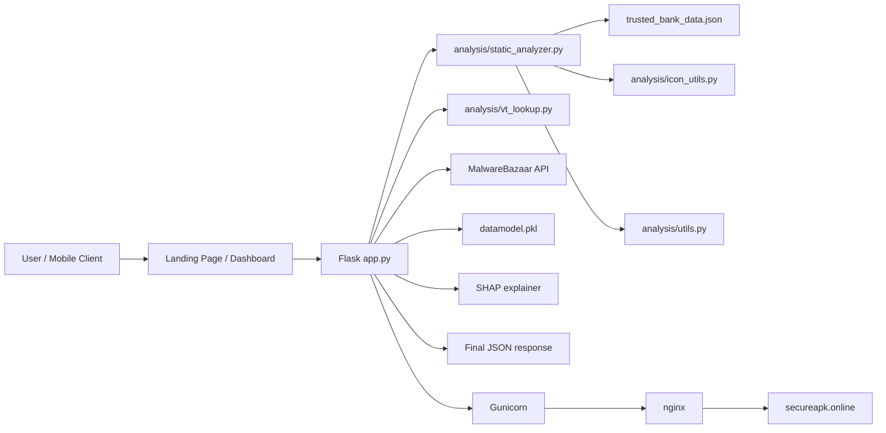
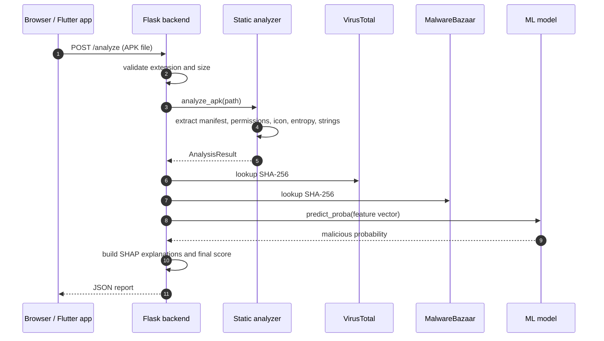
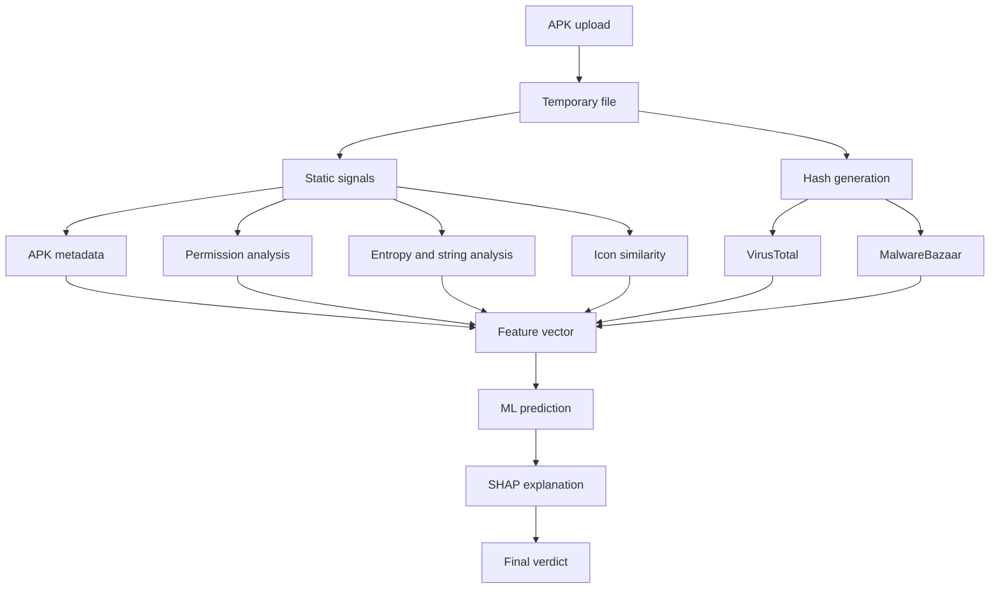

# SecureAPK Architecture

## Overview

SecureAPK uses a layered APK analysis design. The backend receives the uploaded sample, performs static inspection, enriches the result with threat intelligence, and then combines those signals with a machine-learning prediction.

## System components

- **Landing page**: product presentation and entry point
- **Dashboard**: analyst-facing UI for upload and report review
- **Flask API**: request handling and JSON generation
- **Static analysis module**: manifest, permissions, entropy, strings, icon, and certificate inspection
- **Threat intelligence layer**: VirusTotal and MalwareBazaar hash lookup
- **ML layer**: scikit-learn model loaded from `datamodel.pkl`
- **Explainability layer**: SHAP-based feature attribution
- **Trusted reference data**: `trusted_bank_data.json`
- **Deployment layer**: Gunicorn behind nginx on Lightsail
- **Mobile client**: Flutter entrypoint that calls the public backend

## High-level architecture

## Request lifecycle

## Data flow

## Runtime modules

### `app.py`
Main Flask application and HTTP route definitions.

### `analysis/static_analyzer.py`
Performs APK parsing and produces the structured `AnalysisResult`.

### `analysis/utils.py`
Utility helpers for hashing, entropy, string extraction, and APK validation checks.

### `analysis/icon_utils.py`
Extracts the most likely icon and computes perceptual hash similarity.

### `analysis/vt_lookup.py`
Looks up the APK SHA-256 in VirusTotal.

### `datamodel.pkl`
Serialized model bundle containing the trained classifier, scaler, and feature ordering.

### `trusted_bank_data.json`
Reference data used for trusted certificate and icon comparison.

### `templates/index.html`
Analyst dashboard used after upload.

### `templates/landing.html`
Public-facing product landing page.

## Feature engineering notes

The backend turns the APK into a fixed feature vector before model inference. The key signals are:

- permission count
- entropy of `classes.dex`
- certificate trust match
- suspicious string count
- icon similarity
- URL/IP counts
- dangerous permission counts

Those signals are then scaled using the saved scaler before the classifier is run.

## Deployment design

SecureAPK is designed to run as a standard WSGI app:

1. `wsgi.py` exposes the Flask app object.
2. Gunicorn binds to a local port.
3. nginx handles public traffic, TLS, and reverse proxying.
4. Lightsail exposes the public IP and domain.

This keeps the application logic unchanged while allowing a production deployment path.

## Operational notes

- Uploaded APKs are handled as temporary files.
- The maximum upload size is set to 50 MB.
- The static analysis pipeline is CPU-heavy but request-scoped.
- External API calls are made during request processing, so network latency affects end-to-end analysis time.
- The dashboard consumes JSON output from `/analyze` and visualizes it in multiple tabs.
