# SecureAPK


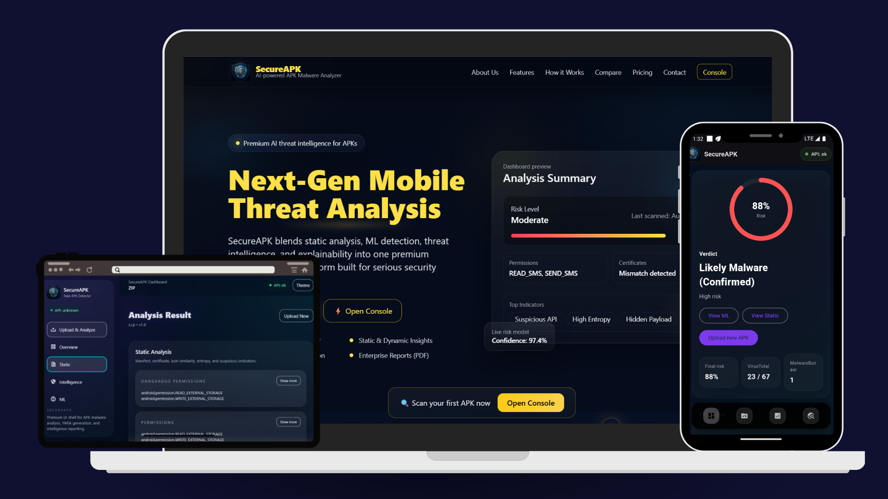

SecureAPK is a hybrid mobile malware analysis platform for APK files. It combines:

- **Static APK analysis** for manifest, permissions, entropy, strings, icon, and certificate signals
- **Threat intelligence lookups** using VirusTotal and MalwareBazaar
- **Machine learning classification** with SHAP-style explainability

The project includes a Flask backend, a browser-based dashboard, a public landing page, and a Flutter mobile client entrypoint.

##  Live Demo

<p align="center">
  <a href="https://secureapk.online/" target="_blank">
    
  </a>
</p>

👉 https://secureapk.online/


> Deployed on AWS Lightsail with production-ready configuration (Gunicorn + Nginx)

## System Architecture
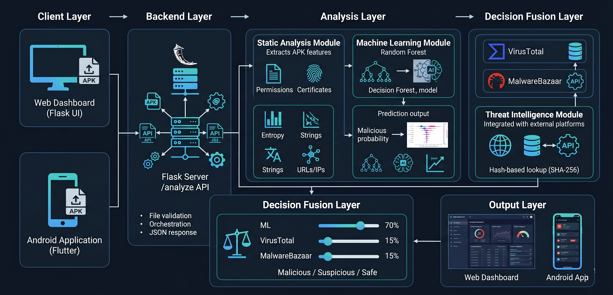

## Project snapshot

| Area | Details |
|---|---|
| Backend | Flask + Gunicorn |
| Analysis engine | Python helpers under `analysis/` |
| ML bundle | `datamodel.pkl` |
| Threat intel | VirusTotal + MalwareBazaar |
| Dashboard | `templates/index.html` |
| Public site | `templates/landing.html` |
| Mobile client | `flutter/lib/main.dart` |
| Deployment | AWS Lightsail ready |

## What SecureAPK does

A user uploads an `.apk` file. SecureAPK then:

1. Validates the file type and size.
2. Extracts APK metadata such as package name, version, permissions, certificate hints, and icon signals.
3. Reads static indicators from `classes.dex` and manifest strings.
4. Queries VirusTotal and MalwareBazaar using the file hash.
5. Builds an ML feature vector from the static signals.
6. Produces a final verdict with a combined score and a human-readable decision.
7. Returns a JSON report and renders the dashboard for interactive review.

The score is not based on a single signal. It is a fusion of model output, threat intelligence, and static analysis.

## Why SecureAPK is Different

- Hybrid detection (ML + Static + Threat Intel)
- Explainable AI using SHAP
- Real-time APK analysis pipeline
- Integrated DevSecOps pipeline
- Production-ready deployment on AWS

## Repository structure

```text
SecureAPK/
├─ app.py
├─ config.py
├─ analysis/
│  ├─ static_analyzer.py
│  ├─ icon_utils.py
│  ├─ vt_lookup.py
│  └─ utils.py
├─ templates/
│  ├─ landing.html
│  └─ index.html
├─ static/
│  └─ assets/
├─ images/
├─ flutter/
│  └─ lib/main.dart
├─ requirements.txt
├─ requirements-lightsail.txt
├─ wsgi.py
├─ start.sh
├─ secureapk.service.sample
└─ nginx-secureapk.conf.sample
```

## Core application flow

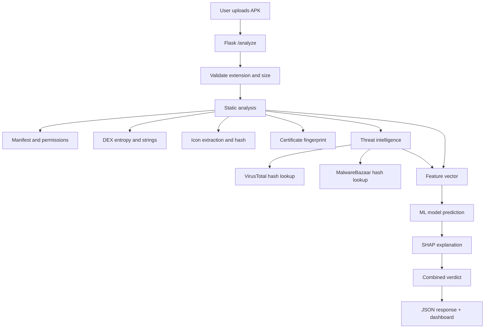

## Dashboard sections

The web dashboard is organized into named tabs so screenshots can be documented later in a clean, recruiter-friendly way.

### 1. Upload & Analyze
This is the entry point for APK submission. It contains the drag-and-drop upload area, file selection, analysis trigger, and progress indicators.

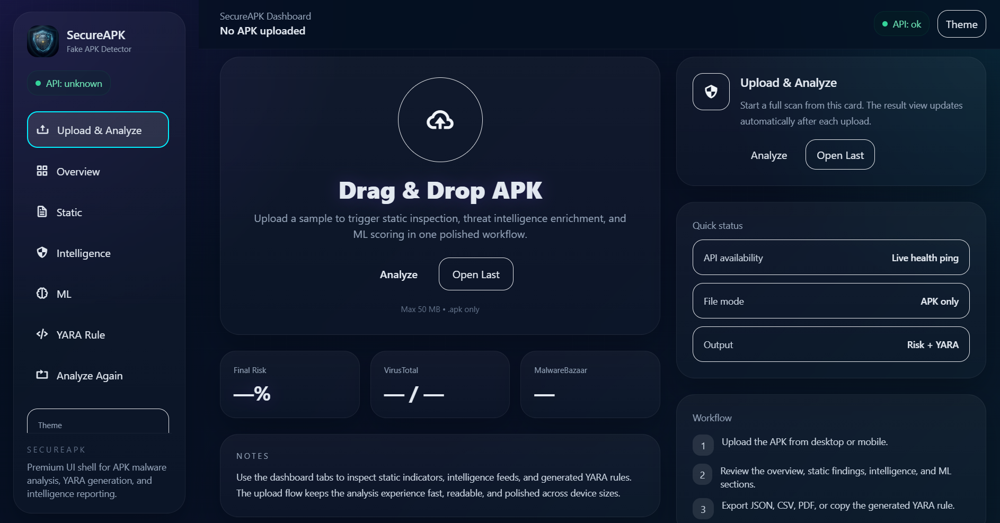


### 2. Overview
This tab summarizes the scan result, final score, verdict, and high-level indicators. It is the executive summary of the analysis.


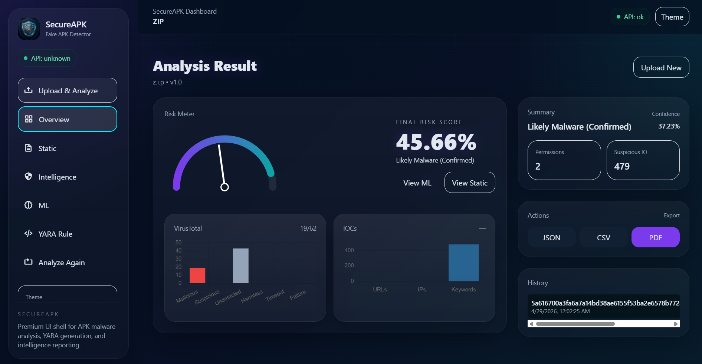

### 3. Static
This tab shows APK metadata and static findings such as:
- package name
- app label
- version details
- permissions
- dangerous permissions
- certificate fingerprint
- icon similarity
- entropy
- suspicious strings and indicators

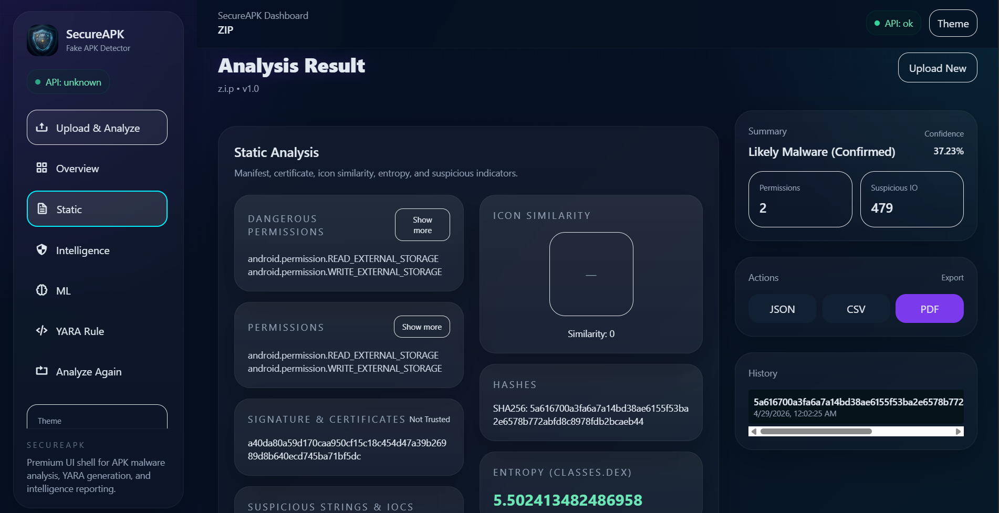

### 4. Intelligence
This tab shows the threat-intelligence outputs from VirusTotal and MalwareBazaar.

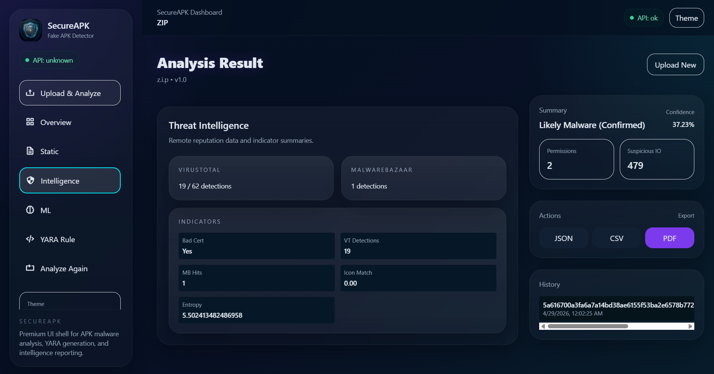

### 5. ML
This tab presents the machine learning probability, the final model decision, and the SHAP-style explanations used to justify the prediction.

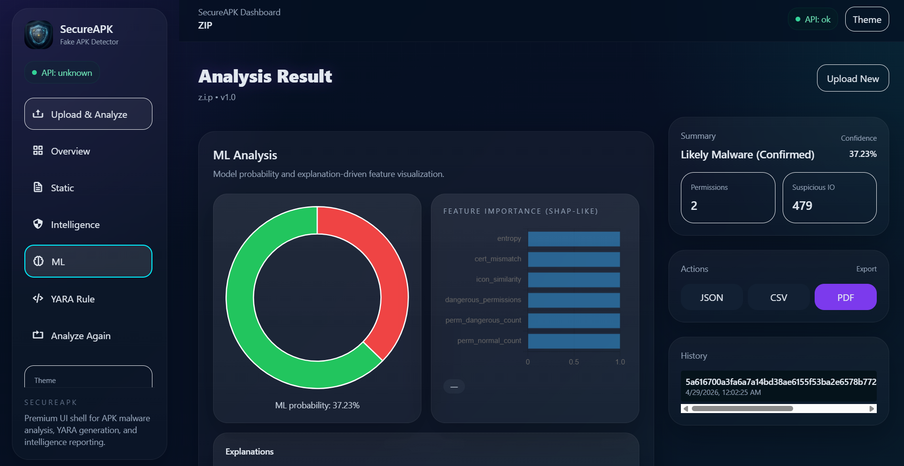

### 6. YARA Rule
This tab renders a generated rule view for analyst-style use and provides copy/download actions.

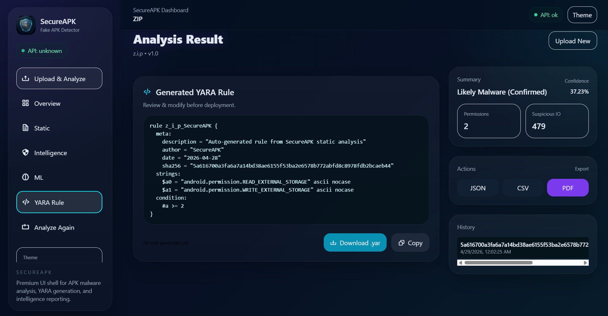

### 7. Mobile UI
Provides a lightweight Flutter-based interface for uploading APK files and viewing analysis results.  
Designed for quick interaction with the SecureAPK backend, enabling real-time mobile malware scanning.


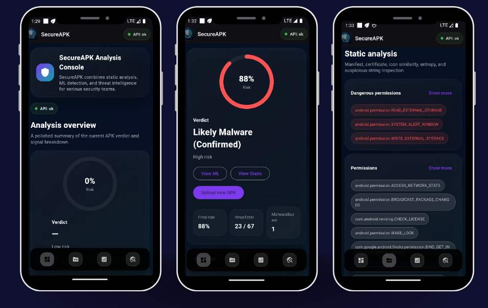
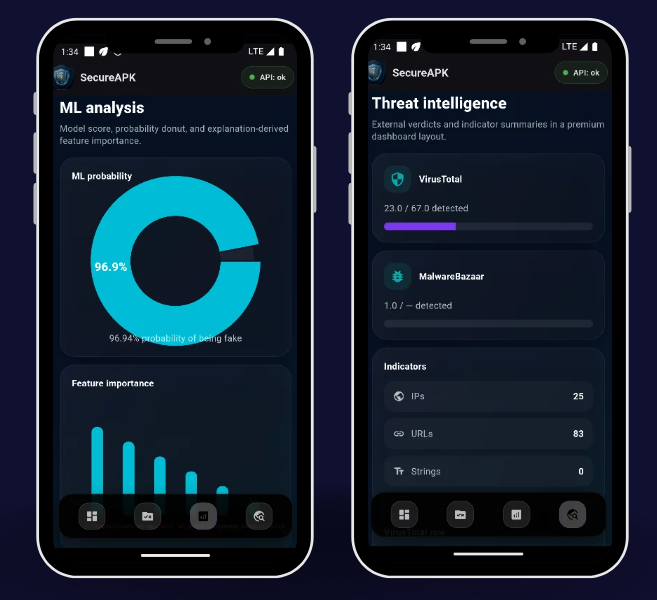


## Landing page sections

The public landing page in `templates/landing.html` is separate from the dashboard and acts as the product website. Its sections are:

- **Hero section**: first impression, product positioning, and primary call-to-action
- **Built for Serious Security**: feature value proposition
- **How it Works**: analysis pipeline walkthrough
- **Core Features**: feature cards for static analysis, ML, threat intel, hybrid scoring, and dashboard
- **Why SecureAPK Wins**: comparison-style section
- **Get Started Today**: download and access calls-to-action
- **Pricing Plans**: product-style packaging section
- **API & Developer Access**: integration and collaboration area
- **Trusted by Security Professionals**: testimonial block
- **Get Latest Threat Alerts**: newsletter signup section
- **Get in Touch**: contact and sales section

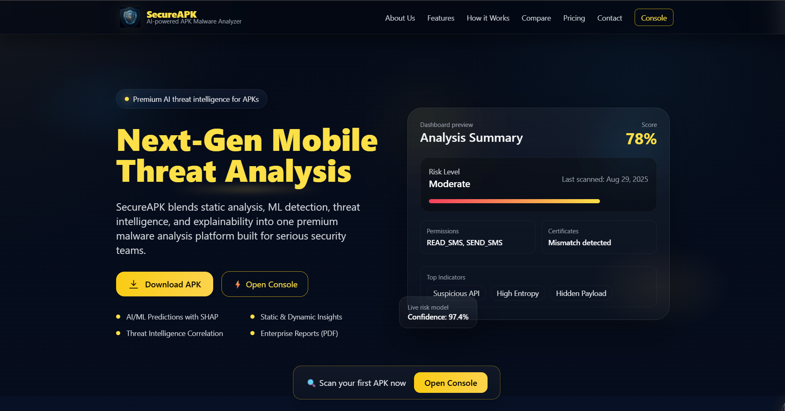

## API endpoints

### `GET /`
Returns the public landing page.

### `GET /dashboard`
Returns the analysis dashboard.

### `GET /health`
Health check endpoint for deployment and uptime monitoring.

### `POST /analyze`
Accepts a multipart form upload with a file field named `file`.

#### Request
```http
POST /analyze
Content-Type: multipart/form-data
```

#### Input constraints
- Only `.apk` files are accepted
- Maximum upload size: **50 MB**

#### Response
The endpoint returns JSON with three major blocks:

- `meta`
- `analysis`
- `model`

Example shape:

```json
{
  "meta": {
    "sha256": "...",
    "package": "...",
    "app_label": "...",
    "version_name": "...",
    "version_code": "..."
  },
  "analysis": {
    "permissions": [],
    "dangerous_permissions": [],
    "cert_fingerprint": "...",
    "cert_trusted_match": false,
    "icon_hash": "...",
    "icon_similarity_score": 0.0,
    "entropy_classes_dex": 0.0,
    "suspicious": {
      "url_count": 0,
      "ip_count": 0,
      "keyword_hits": 0
    },
    "vt": {
      "detections": 0,
      "total": 0
    },
    "malwarebazaar": {
      "detections": 0,
      "query_status": "ok"
    }
  },
  "model": {
    "probability_fake": 0.0,
    "final_score": 0.0,
    "decision": "Likely Safe",
    "explanations": []
  }
}
```

## ML feature set

The backend builds the model input from the following features:

- `permissions_score`
- `entropy`
- `cert_mismatch`
- `suspicious_strings`
- `icon_similarity`
- `ip_count`
- `url_count`
- `dangerous_permissions`
- `cert_trusted_match`
- `perm_dangerous_count`
- `perm_normal_count`
- `perm_custom_count`

The final score is a weighted blend of ML and threat-intelligence signals.

## Tech stack

- **Flask** for backend web serving
- **Gunicorn** for production WSGI serving
- **Pandas / NumPy / SciPy / scikit-learn** for the ML runtime
- **SHAP** for explainability
- **Androguard / apkutils2** for APK inspection
- **Pillow / imagehash** for icon similarity checks
- **Requests** for API lookups
- **Flutter** for the mobile client entrypoint
- **Tailwind CSS** and frontend JavaScript for the web UI

## Setup notes

### Production run
The recommended production entry point is `wsgi.py` with Gunicorn.

### Local run
The backend can be started from the project root after installing dependencies.

```bash
python3 -m venv venv
source venv/bin/activate
pip install -r requirements-lightsail.txt
gunicorn --workers 1 --threads 2 --bind 0.0.0.0:8000 wsgi:app
```

## Deployment on AWS Lightsail

1. Create an Ubuntu Lightsail instance.
2. Attach a static IP.
3. Open ports `22`, `80`, and `443`.
4. Upload this repository zip or clone the repo on the server.
5. Create and activate a Python virtual environment.
6. Install `requirements-lightsail.txt`.
7. Launch `start.sh` or `gunicorn wsgi:app`.
8. Put nginx in front of Gunicorn for public access.
9. Point your domain `secureapk.online` to the instance static IP with `A` records.


## DevSecOps & Security Pipeline

SecureAPK is not only focused on detecting malware in APK files, but also ensures that the **application itself is built securely** using a DevSecOps approach.

A complete CI/CD security pipeline is integrated using GitHub Actions to automatically scan the codebase before deployment.

### Pipeline Overview

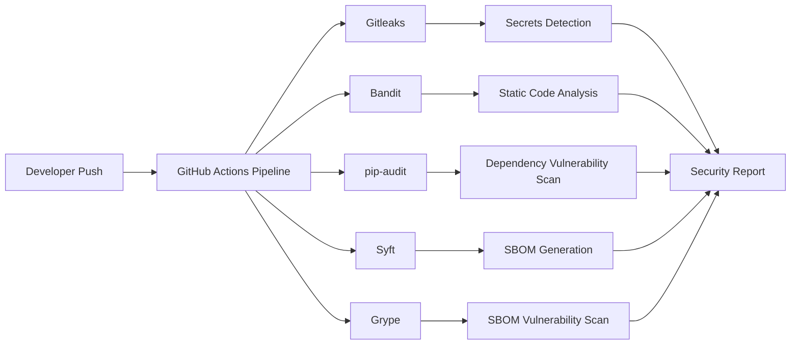
## Security Stages

### 1. Secret Detection (Gitleaks)
- Detects hardcoded secrets such as:
  - API keys
  - tokens
  - credentials  
- Prevents accidental leakage of sensitive data  

### 2. Static Application Security Testing (SAST - Bandit)
- Scans Python code for:
  - insecure functions  
  - weak cryptography usage  
  - command injection risks  
- Helps identify vulnerabilities early in development  

### 3. Software Composition Analysis (SCA - pip-audit)
- Scans Python dependencies for known CVEs  
- Ensures third-party libraries are not vulnerable  

### 4. SBOM Generation (Syft)
- Generates a Software Bill of Materials (SBOM)  
- Provides visibility into all dependencies used  

### 5. SBOM Vulnerability Scanning (Grype)
- Scans the SBOM for known vulnerabilities  
- Adds an additional layer of supply-chain security  


## Pipeline Design Philosophy

- **Non-blocking pipeline** → does not aggressively fail builds  
- **Security-first development** → issues are surfaced early  
- **Extensible design** → easy to add DAST, container scanning, or cloud scanning later  


## Pipeline Location
.github/workflows/pipeline.yaml


## Why This Matters

- Demonstrates **secure SDLC practices**  
- Aligns with **modern DevSecOps standards**  
- Shows readiness for **real-world production environments**  


## Use Cases

- Security researchers analyzing unknown APKs
- SOC teams performing quick triage
- Bug bounty hunters
- Mobile app security testing
- Academic research in malware detection


## Contributing

Contributions are welcome.

A clean contribution flow is:

1. Fork the repository
2. Create a feature branch
3. Make your change
4. Run the app locally
5. Open a pull request with a short summary and screenshots where relevant

Recommended PRs for this project:
- better detection rules
- new APK metadata signals
- additional threat-intelligence sources
- UI polish for the dashboard
- test coverage for analysis helpers
